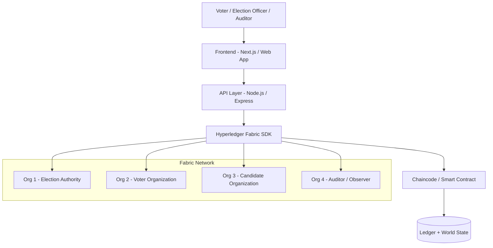
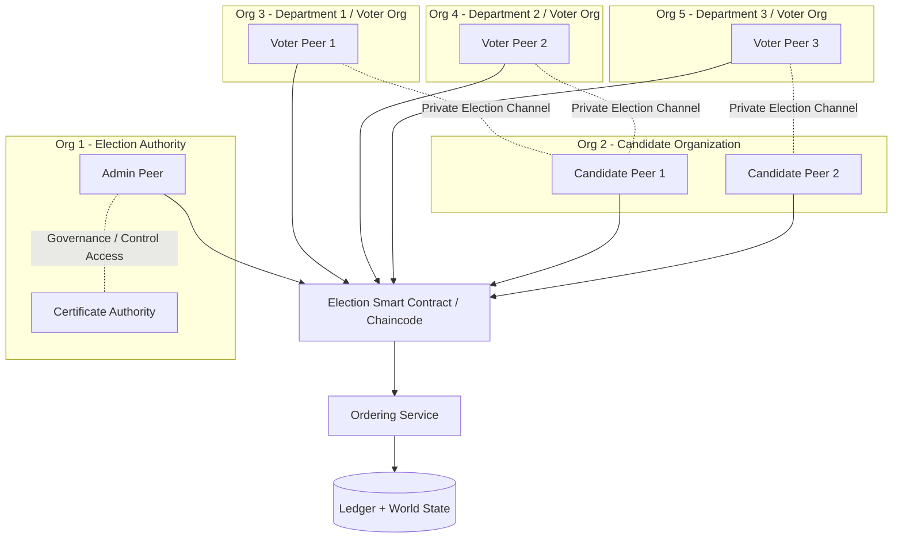

# Hyperledger-Based Blockchain E-Voting System

A secure, transparent, and auditable e-voting platform built on **Hyperledger Fabric**.  
This project extends our earlier research work on blockchain-based voting by moving from a high-level conceptual framework to a more structured smart-contract-driven architecture with stronger election control, vote integrity, auditability, and deployment readiness.

---

## 1. Project Description

Traditional voting systems and many electronic voting implementations face major challenges such as:

- risk of tampering
- lack of transparency
- weak auditability
- centralized control
- operational complexity during election setup and counting
- trust deficit among voters

Our earlier research proposed using blockchain to improve election transparency, reliability, and tamper resistance. The paper specifically highlights the use of **Hyperledger Fabric**, where votes are recorded as blockchain transactions, voter and candidate identities are handled through smart contracts, and the architecture is designed around organizations, nodes, and private channels. It also describes a web application architecture using **Next.js**, **Node.js**, containerized deployment, and Fabric-based transaction execution. :contentReference[oaicite:0]{index=0} :contentReference[oaicite:1]{index=1}

This repository advances that work by introducing a more implementation-oriented design with:

- explicit **election lifecycle management**
- stricter **one-voter-one-vote enforcement**
- **tokenized ballot issuance**
- structured **chaincode interfaces**
- improved **audit events and result finalization**
- better separation of responsibilities across components
- deployment-ready project structure

---

## 2. Research Foundation

This repository is based on our research paper and abstract:

- **Paper:** *Hyperledger-Based Blockchain Technology for Data Security in E-Voting Systems*
- **Abstract / Initial Project Title:** *A Framework to Make Voting System Using Blockchain Technology*

The research motivates blockchain-based voting because blockchain offers:

- decentralization
- immutability
- transparency
- auditability
- secure digital transactions

The paper also proposes using **Hyperledger Fabric** because of its permissioned architecture, access control support, organizations, nodes, channels, and chaincode-based execution model. It further maps the system to a web architecture using **Next.js**, **Node.js**, Fabric SDKs, and containerized hosting on cloud platforms. :contentReference[oaicite:2]{index=2} :contentReference[oaicite:3]{index=3}

---

## 3. What is improved in this advanced version?
The research paper focuses on security, transparency, and vote transfer using blockchain. This repository improves the design by adding a more structured election lifecycle and a safer voting algorithm:

1. **Explicit election phases**
   - Registration
   - Candidate approval
   - Voting open
   - Voting closed
   - Tally finalized

2. **One-person-one-vote enforcement**
   - Each voter has a verified identity record.
   - Each voter can cast only one ballot in a given election.

3. **Privacy-aware ballot storage**
   - Instead of storing plain voting choices directly, the system stores a **ballot commitment hash** on-chain.
   - This reduces exposure of sensitive voting information while preserving auditability.

4. **Auditable result finalization**
   - All state transitions and major voting actions are recorded on the ledger.
   - Final tally can be independently verified against committed voting events.

5. **Cleaner smart contract structure**
   - Separate functions for election creation, voter registration, candidate registration, vote casting, tallying, and query operations.
---
## 4. Research basis
This starter design is grounded in the project abstract and published paper provided by the group. The documents describe:
- a blockchain voting framework,
- one-time voting tokens,
- voter verification through an official database,
- Hyperledger Fabric organizations/nodes/channels,
- and a Node.js + Next.js + Docker-based architecture.

---

## 5. Objectives

The main objective of this project is to build a blockchain-based voting system that is:

- **secure** – votes cannot be altered after submission
- **transparent** – the process is verifiable and auditable
- **private** – voter identity and vote secrecy are preserved
- **traceable** – authorized audit events can be inspected
- **scalable** – suitable for institution-level or department-level elections
- **extensible** – can be improved into a production-grade election platform

---

## 6. Key Features

### 6.1 Current/Planned Features

- Voter registration and eligibility verification
- Candidate registration
- Election creation and scheduling
- Ballot/token issuance to eligible voters
- One-time vote casting
- Prevention of double voting
- Blockchain-backed immutable vote records
- Election status tracking
- Vote tally and result finalization
- Audit log generation
- Permissioned access through Hyperledger Fabric identities
- REST API middleware for frontend integration
- Containerized deployment using Docker

### 6.2 Advanced Improvements 

Compared with the original conceptual model, this repository proposes the following improvements:

1. **Election Lifecycle State Machine**
   - Draft
   - Registration Open
   - Voting Open
   - Voting Closed
   - Result Finalized

2. **Explicit Smart Contract Interfaces**
   - cleaner signatures
   - easier testing
   - clearer rubric alignment

3. **Vote Integrity Controls**
   - one-vote-per-voter restriction
   - immutable on-chain transaction log
   - election-specific vote validation

4. **Auditability**
   - event emission for key actions
   - transparent election closure and result publication

5. **Future Privacy Enhancements**
   - vote commitment hash
   - optional anonymous credential support
   - optional zero-knowledge or commit-reveal based design in future versions

---
## 7. Repository structure

```text
hyperledger-evoting-advanced-starter/
├── README.md
├── github_repository_link.txt
├── .gitignore
├── docs/
│   ├── architecture.md
│   ├── algorithm_advancements.md
│   └── rubric_mapping.md
└── chaincode-javascript/
    ├── package.json
    ├── index.js
    └── lib/
        └── election-contract.js
```
---

## 8. Dependencies / setup instructions

### 8.1 Required software
- Node.js 18+
- npm 9+
- Docker
- Docker Compose (or Docker Desktop)
- Hyperledger Fabric test network or a Fabric deployment environment

### 8.2 Optional but recommended
- Git
- VS Code
- Postman / Bruno for API testing
- A Fabric CA setup for certificate-based identity issuance

### 8.3 Chaincode setup
```bash
cd chaincode-javascript
npm install
```
---

## 9. High-Level Architecture




## 9.1 Fabric Organization and Election Channel Design

The following diagram represents a more deployment-oriented interpretation of the architecture proposed in our research paper.  
The Election Authority manages the election, candidate peers are grouped logically, voter peers belong to different departments/organizations, and voting transactions are executed through permissioned Fabric channels and smart contracts.


---
Project Screenshots


---

## 10. How to use / deploy

### 10.1 Local draft usage
This repository is currently a **starter draft**, not a full production deployment.
You can use it in three steps:

1. Review the smart contract draft in `chaincode-javascript/lib/election-contract.js`
2. Customize the ledger schema and validation rules for your institution or election model
3. Deploy the chaincode to a Hyperledger Fabric test network

### 10.2 Typical deployment flow
1. Start a Hyperledger Fabric network
2. Package and install the JavaScript chaincode
3. Approve and commit the chaincode definition
4. Invoke chaincode methods using the Fabric SDK, CLI, or middleware APIs
5. Build a web app in Next.js / React and connect it through a Node.js backend

### 10.3 Example future deployment architecture
- **Frontend:** Next.js / React portal for admin, voter, and candidate dashboards
- **Backend / API:** Node.js / Express / Fabric SDK
- **Blockchain:** Hyperledger Fabric peers, orderers, CAs
- **Storage:** Ledger state + optional encrypted off-chain metadata store
- **Infra:** Dockerized services on AWS / GCP / local server cluster
---
## 11. Draft smart contract overview

The smart contract in this repository defines a Fabric chaincode component called `ElectionContract`.

### 11.1 Main interfaces / signatures
- `InitLedger(ctx)`
- `CreateElection(ctx, electionId, title, startTime, endTime, adminId)`
- `RegisterVoter(ctx, electionId, voterId, voterNameHash, department, eligibilityHash)`
- `RegisterCandidate(ctx, electionId, candidateId, candidateName, partyName)`
- `OpenVoting(ctx, electionId)`
- `CastVote(ctx, electionId, voterId, candidateId, ballotCommitment)`
- `CloseVoting(ctx, electionId)`
- `FinalizeTally(ctx, electionId)`
- `GetElection(ctx, electionId)`
- `GetCandidate(ctx, electionId, candidateId)`
- `GetVoter(ctx, electionId, voterId)`
- `GetResults(ctx, electionId)`
- `GetElectionAuditTrail(ctx, electionId)`
